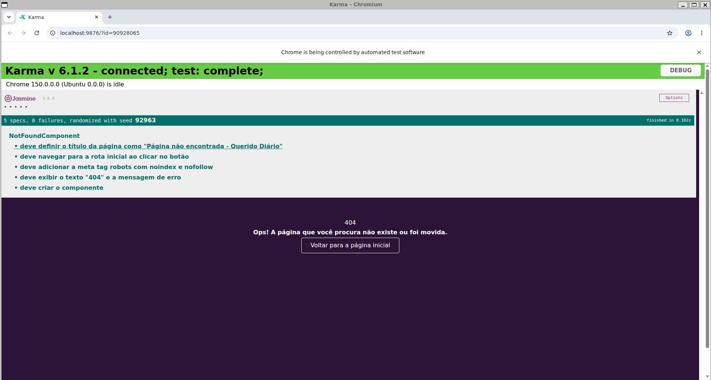

# Cenários de Teste — Querido Diário

Este documento consolida os cenários de teste derivados dos critérios
de aceite de cada história do backlog (`requirements/backlog.md`).

## [1] Tratamento de rotas inválidas com página 404 (IMPLEMENTADA)

**Critério de aceite:**
> Dado que acesso uma URL que não existe no site
> Quando a página carrega
> Então vejo uma página de erro 404 clara, com a tag robots
> noindex/nofollow aplicada

**Cenários:**
- URL inexistente → sistema exibe página 404 customizada
- Meta tag `robots noindex, nofollow` presente no `<head>` da página 404
- Botão "Voltar para a página inicial" navega corretamente para `/`
- URLs válidas continuam funcionando normalmente (rota coringa não
  interfere nas demais rotas)

**Status:** implementado e coberto por testes automatizados (Karma +
Jasmine), 5/5 passando. Ver `src/app/modules/pages/not-found/not-found.component.spec.ts`.

---

## [2] Padronização de banners do blog por categoria

**Critério de aceite:**
> Dado que acesso a listagem de postagens do blog
> Quando uma postagem pertence a uma categoria específica
> Então vejo um banner padronizado e visualmente distinto para aquela
> categoria, ao invés da imagem genérica atual

**Cenários:**
- Postagem com categoria definida → sistema exibe banner específico da
  categoria
- Postagem sem categoria definida → sistema exibe banner padrão/genérico
- Banners mantêm proporção e dimensão consistente entre categorias
  diferentes (não distorcem o layout)

**Status:** não implementado (hipotética, planejada apenas no backlog).

---

## [3] Indicador de carregamento durante a busca

**Critério de aceite (refinado com apoio de IA — ver `/ai-usage`):**
> Dado que estou na página de busca e submeto um termo de pesquisa
> Quando a requisição para a API de busca é disparada
> Então um indicador de carregamento substitui a área de resultados em
> até 100ms, permanecendo visível até a resposta chegar ou até 10
> segundos (timeout), quando uma mensagem de erro é exibida no lugar

**Cenários:**
- Busca com resposta rápida → indicador aparece e desaparece de forma
  fluida, sem "piscar"
- Busca com resposta lenta (simulada) → indicador permanece visível
  durante toda a espera
- Erro na requisição → indicador é substituído por mensagem de erro,
  não fica travado indefinidamente
- Requisição concluída em menos de 100ms → indicador não chega a ser
  renderizado (evita efeito de "flash" visual)
- Requisição que ultrapassa 10 segundos sem resposta → spinner é
  removido automaticamente e mensagem de timeout é exibida

**Status:** não implementado (hipotética, planejada apenas no backlog).

---

## [4] Mensagem clara para busca sem resultados

**Critério de aceite:**
> Dado que realizo uma busca por um termo
> Quando a API retorna zero resultados
> Então vejo uma mensagem clara informando que nenhuma publicação foi
> encontrada, com sugestão de ajustar os filtros de busca

**Cenários:**
- Busca sem resultados → exibe mensagem específica de "nenhum resultado
  encontrado"
- Busca com resultados → mensagem de "sem resultados" não aparece
- Mensagem inclui sugestão acionável (ex: "tente termos diferentes" ou
  link para limpar filtros)

**Status:** não implementado (hipotética, planejada apenas no backlog).

---

## [5] Filtro de busca por período (data inicial e final)

**Critério de aceite:**
> Dado que estou na página de busca
> Quando seleciono uma data inicial e uma data final e realizo a busca
> Então os resultados exibidos pertencem exclusivamente ao intervalo
> selecionado

**Cenários:**
- Intervalo de datas válido → resultados filtrados corretamente
- Data inicial posterior à data final → sistema exibe erro de validação
  e não realiza a busca
- Nenhuma data selecionada → busca funciona normalmente, sem filtro de
  período aplicado

**Status:** não implementado (hipotética, planejada apenas no backlog).

## Resumo de cobertura

| História | Cenários definidos | Testes automatizados |
|---|---|---|
| [1] Página 404 | 4 | 5 (Karma/Jasmine) |
| [2] Banners do blog | 3 | 0 (não implementada) |
| [3] Indicador de carregamento | 5 | 0 (não implementada) |
| [4] Busca sem resultados | 3 | 0 (não implementada) |
| [5] Filtro por período | 3 | 0 (não implementada) |

Apenas a história [1] foi priorizada para implementação neste ciclo
(ver justificativa em `requirements/backlog.md`), sendo a única com
testes automatizados executáveis no momento.

## Evidência de execução

Execução real da suíte de testes da história [1] via Karma + Jasmine,
confirmando 5 specs executados e 0 falhas:

